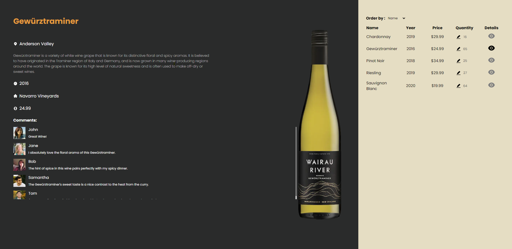
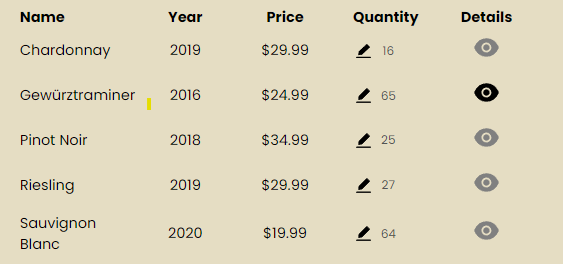
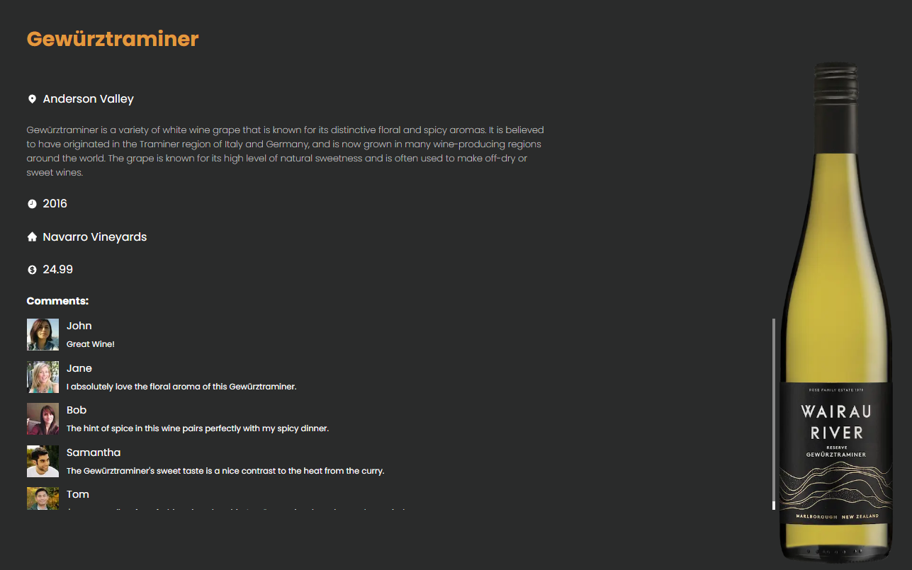
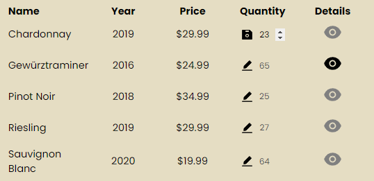
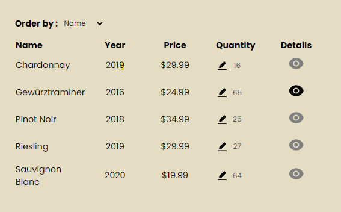
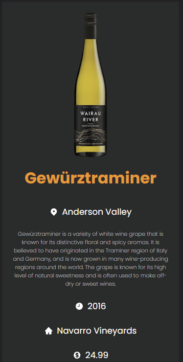

# Winery App

# 

## Installation

```bash
git clone https://github.com/FlashCodX/winery
cd winery
npm i
```

Make sure you install json server on your system, by running:

```bash
npm i -g json-server
```

Run the json server, on port 3001 the the db.json file.

```bash
json-server db.json --port 3001 --watch
```

Run the App

```bash
npm run dev
```

## App Functionalities

- List View (Shows a list of available wines).

# 

- Detail views (Shows detailed information of a specific wine).

# 

- Add, Update and delete bottles (quantity).

# 

- Order functionality (Sorts all the wines by name, year, quantity, or price).

# 

- Mobile friendly

# 

## Testing

Run Cypress

```bash
npm run cypress
```

## Tech

- [React] - HTML enhanced for web apps!
- [NextJS] - HTML enhanced for web apps!
- [Cypress] - Used to prevent class overlap.

## License

MIT

**Free Software!**

[react]: https://reactjs.org/
[nextjs]: https://nextjs.org/
[cypress]: https://www.cypress.io/
